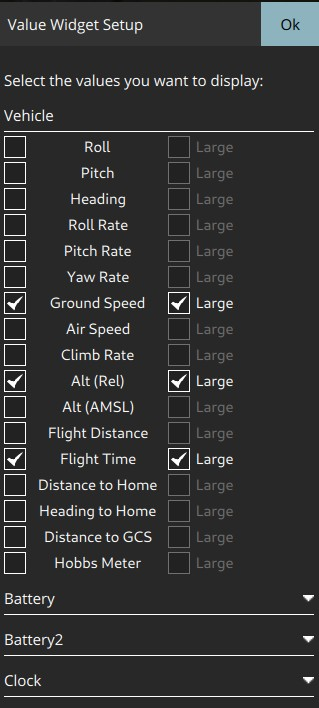

# Fly View

The *Fly View* is the main view you will use while flying your vehicle.
You can switch between a map view and a video view (if available).

## Map

The map will show you the positions of all the vehicles you are connected to.
It will also show you the mission for the current vehicle.

## Fly Tools

On the left edge of the screen you will see the Fly Tools. The order of tools from top to bottom is:

* Takeoff/Land
* Return To Launch
* Pause
* Action

### Center Map

The Center Map tool allow you to center the map around various points such as home position, vehicle and so forth.

### Map Type

This tool allows you to change the current map type between Street, Satellite and Hybrid (Street+Satellite). 
The default map provider is Bing since it seems to provide better Hybrid maps. 
You can change the map provider from the General page of Settings.

## Video

At the lower left of the display you will see video output. 
QGroundControl supports RTP and RTSP video streaming over your vehicles UDP connection. 
It also support directly connected UVC device support. 
More details on QGC Video support can be found on the [Video README](https://github.com/mavlink/qgroundcontrol/blob/master/src/VideoStreaming/README.md).

By clicking on the video you can make it be the main display for the Fly view.

## Instrument Panel

To the right is an instrument panel showing you current information on your vehicle. 
The center section of the panel has multiple pages. 
You can switch between pages by clicking on the title of the panel.

### Telemetry Values page

The telemetry page is able to display telemetry data that the operator deems relevant, such as altitude, temperature, and link quality.

The values shown within the telemetry page can be configured by clicking on the small gear icon. They can be shown small (two per row) or large (one per row).

### Camera page

This page allows control of the camera.

 If your setup supports the [Mavlink camera messages](https://mavlink.io/en/services/camera.html), this enables advanced camera controls, such as changing between pciture and video mode, starting recording/taking pictures, and changing advanced settings by clicking the gear icon at the top.

The changeable camera settings are exposed via the Mavlink API by the vehicle.

### Video Stream page

This page allows starting/stoping the video stream, enabling a grid overlay, changing how the image fits the screen, and recording the video locally with QGC.

### Vehicle Health page

This page shows you the health of the systems within your Vehicle.
If any of the systems switches from healthy to unhealthy this page will automatically be switched to.

### Vibration Clipping page

This page shows you current vibration values and clip counts.

## Guided Bar

At the bottom of the view is the *Guided Bar*.
The guided bar allows to to interact with your vehicle directly from the *QGroundControl* application. 
Options available vary by Vehicle and current Vehicle state. 

Some of the possible options are:

* Arm, Disarm, Emergency Stop
* Takeoff
* Change altitude
* Go to location
* RTL
* Pause
